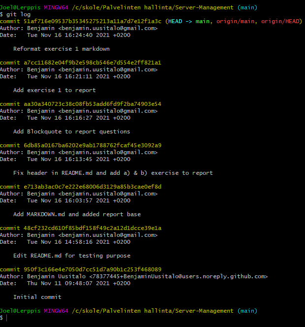
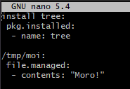
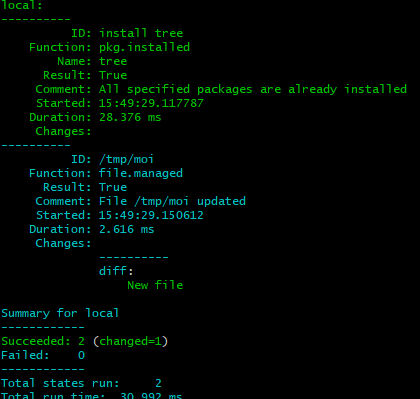

# H3

## Lue ja tiivistä artikkeli muutamalla ranskalaisella viivalla

**Commonmark contributors: Markdown Reference** 

`# Heading 1`
`## Heading 2`
`print 'indent 4 spaces'`
`# code block`
`* List`
`[Link](http://a.com)`
``

## a) Markdown

> Tee tämän tehtävän raportti MarkDownina. 
> Helpointa on tehdä raportti GitHub-varastoon, jolloin md-päätteiset tiedostot muotoillaan automaattisesti. 
> Tyhjä rivi tekee kappalejaon, risuaita ‘#’ tekee otsikon, sisennys merkitsee koodinpätkän.

Ensiksi loin GitHubiin repositoryn. Kloonasin kyseisen repon GitBashiin. Loin sinne tiedoston MARKDOWN.md. 

Tämän jälkeen annoin seuraavat komennot. 
* Git add .
* Git commit -m "Add MARKDOWN.md and added report base"

*Huomasin jälkeenpäin, että verbi oli väärässä muodossa.*
* Git pull
* Git push

Näin tämä raportin sisältävä tiedosto luotiin markdownina.

## b) Pull first

>Tee useita muutoksia git-varastoosi. 
>Tee muutama muutos, jossa yksi commit koskee useampaa tiedostoa. 
>Anna hyvä kuvaukset (commit message), yksi englanninkielinen lause imperatiivissa (määräysmuodossa) 
>"Add top level menu to Foobar synchronizer"

Muokkasin ensin 
README.md tiedostoa, jonka jälkeen lisäsin 
MARKDOWN.md tiedostoon tekstiä. 
Sen jälkeen annoin komennot
* Git add –-all
* Git commit -m
* Git pull
* Git push

## c) Kaikki kirjataan

>Näytä omalla git-varastollasi esimerkit komennoista ‘git log’, ‘git diff’ ja ‘git blame’. Selitä tulokset.

Git log, näyttää kaikki tehdyt commitit.

Git diff näyttää muutokset committien, treen, branchien yms. Välillä
Kokeilin paria komentoa tuloksetta

Git blame, näyttää kuka viimeksi muokkasi tiedoston kutakin riviä.

## d) Huppis! 

>Tee tyhmä muutos gittiin, älä tee commit:tia. 
>Tuhoa huonot muutokset ‘git reset --hard’. Huomaa, että tässä toiminnossa ei ole peruutusnappia.

Loin ensiksi uuden markdown -tiedoston

Tämän jälkeen käytin git reset --hard -komentoa

Tiedosto oli poistunut ja palattiin uusimpaan commit-versioon

## e) Formula. 

>Tee uusi salt-tila (formula, moduli, infraa koodina). 
>(Eli uusi tiedosto esim. /srv/salt/terontila/init.sls). 
>Voit tehdä ihan yksinkertaisen parin funktion (pkg, file...) tilan, tai edistyneemmin 
>asentaa ja konfiguroida minkä vain uuden ohjelman: demonin, työpöytäohjelman tai komentokehotteesta toimivan ohjelman. 
>Käytä tarvittaessa ‘find -printf “%T+ %p\n”|sort’ löytääksesi uudet asetustiedostot.

Loin init.sls tiedoston formula -nimiseen hakemistoon, johon laitoin seuraavat komennot

Jonka jälkeen ajoin komennon *sudo salt-call --local -l info state.apply formula* onnistuneesti

