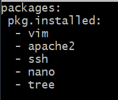
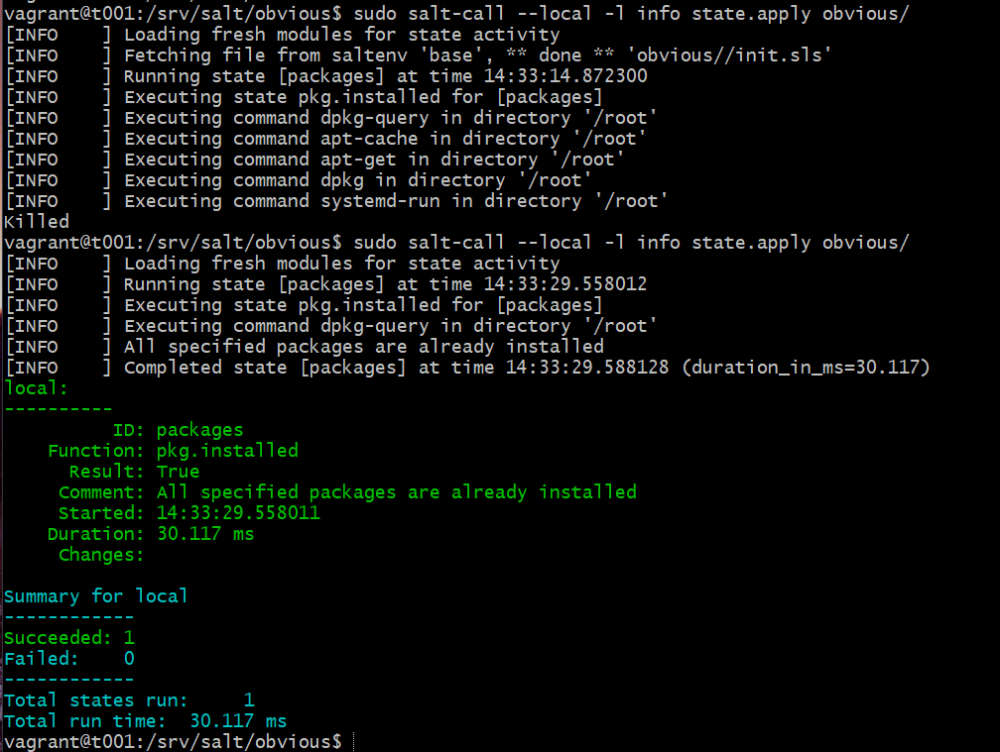
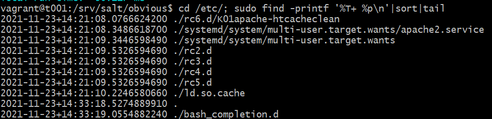
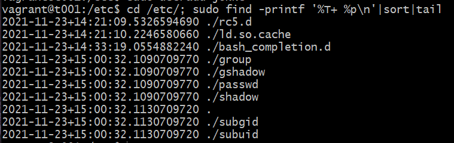
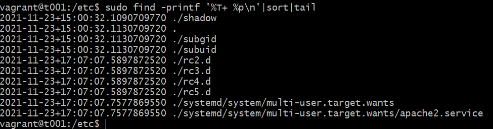
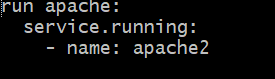

# H4

## a) Captain obvious.

> Linuxissa on paketinhallinta, joten ohjelmien asentaminen on yksinkertaista. Tee tila, joka asentaa 10 suosikkiohjelmaasi paketinhallinnasta.
> Tässä a-kohdassa voit jättää ohjelmat oletusasetuksille.

Tein sls tiedoston, jossa asennetaan seuraavat paketit (en keksinyt kymmentä):

Ajoin komennon sudo salt-call --local -l info state.apply obvious/

Sain ensin tulokseksi ”killed”, mutta ajamalla komennon uudelleen onnistui asennus; tai siis paketit oli jo asennettu.

## b) CSI Pasila.

> Tiedostoista saa aikajanan 'cd /etc/; sudo find -printf '%T+ %p\n'|sort|tail'.
> Anna esimerkki aikajanasta

Komento ajettuna /etc kansiossa

> Selitä jokainen kohta komennosta, jolla aikajana tehdään. Vinkki: '%T+' löytyy 'man find' kohdasta printf.

* Find -komento näyttää tiedostot.

* Printf:llä saadaan näkyviin, joku tietty merkkijono tai numero

* %T, antaa ajan, %p tiedoston nimen ja \n antaa rivinvaihdon.

* Sort järjestää tulostuksen aika- ja aakkosjärjestykseen.

* Tail tulostaa vain 10 viimeisintä listattavaa.

> Aja jokin komento, joka muuttaa järjestelmän yhteisiä asetustiedostoja

> Ota uusi aikajana ja etsi muutos sieltä

> Onko samalla hetkellä muutettu yhtä vai useampaa tiedostoa?

Loin uuden käyttäjän, jolloin logit näyttää samanaikaisia muutoksia esim. /passwd ja /shadow -hakemistoihin

## c) Tiedän mitä teit viime kesän^H^H^H komennolla.

> Säädä jotain ohjelmaa ja etsi sen muuttamat tiedostot aikajanasta. Tee sitten tästä oma Saltin tila.

En tiedä lasketaanko, mutta käynnistin apachen ja se näkyi aikajanalla.

Jäi vähän epäselväksi, mistä oli tarkoitus tehdä Salt-tila, mutta tein tilan joka, sitten käynnistää Apachen

## d) Asenna jokin toinen ohjelma asetuksineen.

Tähän en enää keksinyt mitä ohjelmaa asentaa, tai varsinkaan, mitä asetuksia muuttaa.

