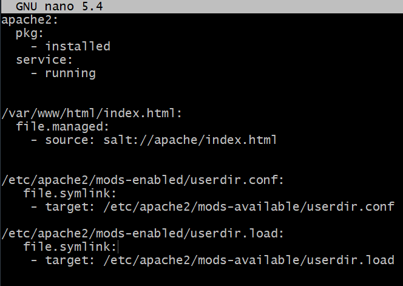

#h5

## a) Watch it! 

> Asenna Saltilla SSHD asetuksineen. Lisää ssh-demonille ylimääräinen portti. 
> Osoita testein, että uusi portti toimii. 
> Vaihda porttia masterilla olevasta asetustiedoston mallista (/srv/salt/sshd/sshd_config tms), aja tila orjille, ja osoita testein, että palvelin käynnistyy, jos ja vain jos asetustiedoston malli masterilla on muuttunut. 
> Vinkki: Karvinen 2018: Pkg-File-Service – Control Daemons with Salt – Change SSH Server Port

Tein sshd nimisen kansion srv/salt hakemistoon. Seuraavaksi tein seuraavanlaiset tilat sisältävän init.sls tiedoston.
 

Kopioin sshd_config -tiedoston sshd-kansioon
*sudo cp -v /etc/ssh/sshd_config /srv/salt/sshd/*, 

jossa muutin käytettäväksi portiksi portin 2222 

Lähde: Karvinen T. 2018 Pkg-File-Service – Control Daemons with Salt – Change SSH Server Port

Luettavissa: https://terokarvinen.com/2018/pkg-file-service-control-daemons-with-salt-change-ssh-server-port/?fromSearch=salt%20service

Luettu: 30.11.2021

Asetin aiemmin tekemät salt tilat 

*sudo salt-call --local state.apply sshd*

ja vastaukseksi sain yhden onnistuneen tilan ja kaksi epäonnistunutta.

Kävin katsomassa onko muilla ollut samanlaisia ongelmia ja huomasin virheen tilassani:

/etc/ssh/sshd_config:
  file.managed:
    - source: salt://sshd_config
--->

/etc/ssh/sshd_config:
  file.managed:
    - source: salt://sshd/sshd_config

Lähde: Lintula T. 2021

Luettavissa: https://tuomaslintula.wordpress.com/2021/11/29/tehtava-h5-2/

Luettu: 30.11.2021

Virheen korjattua komento meni läpi.

## b) Securerer shell. 

>Tee Saltin kautta jokin muu sshd:n asetus ja osoita, että se toimii. 
>Siivoa sshd_configista turhat kommenttirivit. Laita tiedostoon kommentti, jossa varoitetaan
>, että tiedosto ylikirjoittuu automaattisesti. Liitä siivottu sshd_config vastaukseesi.

## c) Maailman suosituin. 

>Tee Salt-tila (eli formula, siis omaa infraa koodina), joka asentaa Apache-weppipalvelimen. Korvaa testisivu /var/www/html/index.html sivulla, jossa lukee vain "Hello".

Loin uuden apache -nimisen kansion srv/salt hakemistoon ja sinne init.sls tiedoston ja ajoin sen. 

Tein testisivutiedoston, johon kirjoitin ”Hello” samaan kansioon ja tilan korvaamaan  /var/www/html/index.html.

Asetin tilan ja oletan, että tulos oli toivottu 

## d) Minä ja kissani. 

>Lisää Apache-reseptiisi (siihen Saltilla kirjoittamaasi) tuki käyttäjien kotisivuille. Voit laittaa kotisivut päälle 'a2enmod userdir', ottaa /etc/-tiedostoista aikajanan ja tehdä tarvittavat symlinkit file.symlink.

Ajoin komennon a2enmod userdir, ja katsoin aikajanan /etc hakemistosta, joka näytti muutoksia
/apache2/mods-enabled/userdir.conf ja /apache2/mods-enabled/userdir.load -tiedostoihin.

Muokkasin alkuperäistä salt-tilaa, lisäämällä symboliset linkit osoittamaan edellä mainittuihin osoitteisiin.

Lähde: SALTSTACK

Luettavissa: https://docs.saltproject.io/en/latest/ref/states/all/salt.states.file.html#salt.states.file.symlink

Luettu: 30.11.2021

Ajoin tilan uudelleen ja muutokset onnistuivat.

## e) Valmiiseen pöytään.

>Tee käyttäjille valmiit esimerkkikotisivut siten, että esimerkkikotisivu syntyy käyttäjää luodessa. Katso, että sivuille tulee oikea omistaja. Vinkki: /etc/skel/ kopioidaan luoduille käyttäjille. Kotisivuja etsitään osoitteesta /home/tero/public_html/index.html.

Tein uuden hakemiston, johon tein index.html tiedoston ja init.sls tiedoston, jossa kopioidaan /etc/skel/public_html -hakemistoon index.html tiedosto.

Asetin tilan ja tein uuden käyttäjän, jolla katsoin /home/user/public_html/index.html sisällän ja kotisivu oli siellä.

Lähteet: SALTSTACK

Luettavissa: https://docs.saltproject.io/en/latest/ref/states/all/salt.states.file.html

Luettu: 30.11.2021

## f) Moottorix. 

>Tee Salt-tila, joka asentaa Nginx-weppipalvelimen ja tekee sille jonkin asetuksen. Vinkki: ensin käsin, vasta sitten automaattisesti. Tässä tehtävässä osa haastetta on selvittää, miten Nginx otetaan käyttöön.

Asensin Nginxin ensin ihan käsin. Katselin Ubuntun ohjetta nettisivun luomiseen ja ohjeessa näkyi, että oletussivu menee /var/www/html hakemistoon, jonne asennus loikin oletussivun index.nginx-debian.html

Lähde: Mikołajczak M. Creating our own website

Luettavissa: https://ubuntu.com/tutorials/install-and-configure-nginx#3-creating-our-own-website

Luettu: 30.11.2021

Tein uuden hakemiston "nginx", johon tein sls.init tiedoston, joka asentaa nginxin ja päivittää oletussivun

 
Sekä kopsasin var/www/html/ index.nginx-debian.html tiedoston, jonka sisältöä muokkasin sanomaan vain ”testi”.

Asetin tilan ja tsekkasin toimiko

