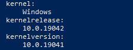
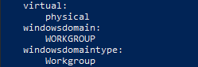
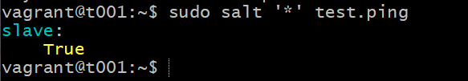
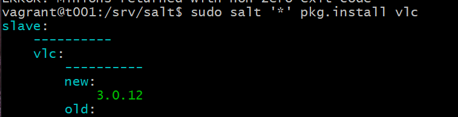
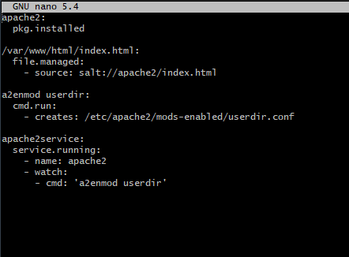

# H6

## z) Lue ja tiivistä artikkeli muutamalla ranskalaisella viivalla.

>Karvinen 2018: Control Windows with Salt

https://terokarvinen.com/2018/control-windows-with-salt/

* Lataa ja asenna sama Salt-version salt-minion-paketti Windowsissa (tulevassa) orjassa. Haluat todennäköisesti Python 3- ja amd64-version.

* Windows-työpöydällä hyödylliset työkalut -valikko avautuu Windows-X:llä. Valitse "Windows PowerShell (järjestelmänvalvoja)

>Karvinen 2018: Configure Windows and Linux with Single Salt Module

https://terokarvinen.com/2018/configure-windows-and-linux-with-salt-jinja-if-else-and-grains/

* Jos käyttöjärjestelmä on Windows, polku on C:\tero. Jos käyttöjärjestelmä on Linux, polku on "/tmp/tero". 
Ehdollisten ehtojen avulla voit luoda Salt-moduuleja, jotka toimivat useissa käyttöjärjestelmissä.

>SaltStack contributors 2021: Windows Package Manager

https://docs.saltproject.io/en/latest/topics/windows/windows-package-manager.html

* Windows Package Manager tarjoaa ohjelmistovaraston ja paketinhallinnan, joka on samanlainen kuin yum ja apt Linuxissa. 
Tämä työkalu mahdollistaa ohjelmistojen asennuksen Windows-etäjärjestelmiin.

* Windowsin Package Manageria käytetään samalla tavalla kuin muitakin Saltin tuntemia paketinhallintaohjelmia. Esimerkiksi:

```
pkg.installed

```
ja vastaavat tilat toimivat Windowsissa.

```
pkg.install

```

ja vastaavat moduulitoiminnot toimivat Windowsissa.

## a) Kerää tietoa Windowsista Saltilla.

> Mitkä kohdat ovat erityisesti Windowsin osalta kiinnostavia? Selitä kohdat.

Käytin windowsin PowerShellissä komentoa

```
salt-call –local -l info grains.items
```
Jolla saa näkyviin, esimerkiksi käyttöjärjestelmäytimen ja -version: 


 
sekä domain-tiedot:
 


## b) Asenna ohjelmia Windowsille Saltilla.

Aloitin tekemällä uuden virtuaalikoneen Vagrantilla, johon asensin uudet salt-masterin ja -minionin. 
Windows-rautani, jossa salt jo asennettu, toimii siis orjana tässä tilanteessa. 
Varmistin, että molemmissa on uusin salt-versio. Lisäsin Debian-herran IP:n orjalle C/Program/Data/Salt/Conf/minion. 
Hyväksyin orjan avaimen ja testipingasin.


 
Nyt Debian-virtuaalikone on herrana ja Windows-rauta orjana. Seuraavaksi kokeilin asentaa VLC:n Windows-koneelle.

Aloitin ottamalla käyttöön Salt Windows Software Repositoryt.

```
sudo mkdir /srv/salt/win
sudo chown root.salt /srv/salt/win
sudo chmod ug+rwx /srv/salt/win
```
Jonka jälkeen

```
sudo salt-run winrepo.update_git_repos
sudo salt -G 'os:windows' pkg.refresh_db
```

Tämän jälkeen käytin komentoa

``` 
sudo salt '*' pkg.install vlc

```
onnistuneesti



Lähteet: Karvinen T. 2018

Luettavissa: https://terokarvinen.com/2018/control-windows-with-salt/

Luettu: 13.2.2021

## c) Draft zero. 

>Tee ensimmäinen versio omasta miniprojektistasi. Sen ei tarvitse olla vielä valmis, 
>vaan se voi vaikkapa toteuttaa pienen osan tarvittavasta toiminnallisuudesta. 
>Jonkin (pienenkin) asian pitää kuitenkin toimia niin, että projektisi säätää jotain Saltilla tai vastaavalla työkalulla.

En ole vielä päättäny lopullisesti, minkä haluan projektin aiheeksi, mutta aloitin tekemällä helpon ja tomivan formulan, 
jolla saa asenettua ja käynnistettyä apachen ja sille index.html -sivun. Sls-tiedosto näyttää seuraavalta:



ja ajoin sen lokaalisti testataakseni tomivuuden:


Lähteet: 

Karvinen T.2008. https://terokarvinen.com/2008/install-apache-web-server-on-ubuntu-4/

Luettu 7.12.2021

Karvinen T. 2018. https://terokarvinen.com/2018/pkg-file-service-control-daemons-with-salt-change-ssh-server-port/?fromSearch=salt%20service

Luettu 7.12.2021

Uusitalo J. 2021. https://github.com/BenjaminUusitalo/Server-Management/blob/main/H5.md

Luettu 7.12.2021

## d) Tee omalle miniprojektille weppisivu. 

Nettisivuna projektille tulen käyttämään Githubia.
